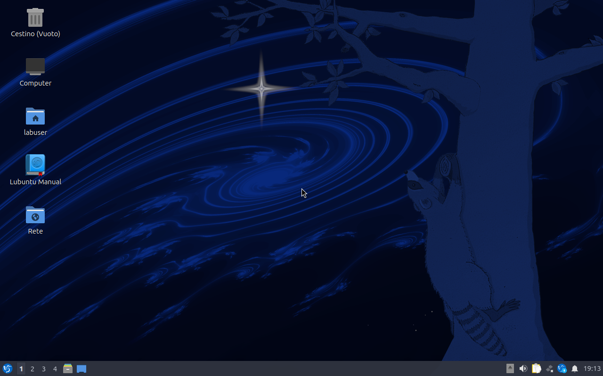
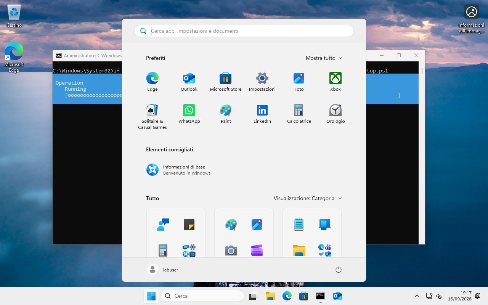

# qemu-playground

**Two desktops. Unattended installs. A record of every run.**

A small QEMU/KVM lab for **Lubuntu 26.04 (LXQt)** and **Windows 11**.
Follow the guided terminal menu or run the same commands yourself. Each installation
leaves logs, screenshots and an offline HTML report you can inspect.

[Quick start](#quick-start) · [Usage guide](docs/USAGE.md) · [Windows setup](docs/WINDOWS.md) · [CLI reference](docs/CLI.md) · [Validation](docs/VALIDATION.md)

## See the guests

<table>
  <tr>
    <th>Lubuntu 26.04 · LXQt</th>
    <th>Windows 11</th>
  </tr>
  <tr>
    <td width="50%"><a href="docs/images/lubuntu-26.04-installed.png"></a></td>
    <td width="50%"><a href="docs/images/windows-11-installed.png"></a></td>
  </tr>
  <tr>
    <td>Installed from the seed, then booted from its own disk into LXQt.</td>
    <td>Past OOBE, with the unattended OpenSSH setup still running.</td>
  </tr>
</table>

Real guest captures taken passively through QMP. Click either image for full size;
see the [validation record](docs/VALIDATION.md) for the runs and their limits.

## What you get

- **A guided workflow** — environment → ISO → preparation → installation → use the VM.
  The Bash/fzf menu shows the CLI command behind each action.
- **A small, isolated lab** — no libvirt, system services, personal SSH configuration
  or root privileges needed for normal operation.
- **Observable installations** — passive screenshots, serial logs, explicit verdicts
  and self-contained reports. Failed disks stay available for inspection.
- **Two ways into the guest** — a graphical console and key-only SSH, with QEMU
  guest agent commands available without guest networking.

## Quick start

Use a Linux host with **Python 3.10+**, Bash and access to KVM. `doctor` checks the
remaining tools, RAM and disk space; its dependency installer uses apt.
Internet access is required for Lubuntu's desktop packages.

From the repository directory:

```bash
./lab doctor                 # inspect prerequisites and suggested fixes
./lab doctor --install       # if needed: asks before installing tools with sudo
./lab config init            # creates private .env; prints the console password
./lab                        # open the guided menu
```

Prefer the CLI? Once prerequisites are ready:

```bash
./lab up lubuntu-26.04 --dry-run     # preview without changing anything
./lab up lubuntu-26.04 --foreground  # download, install, boot and check readiness
```

Lubuntu uses the pinned Ubuntu Server ISO to install the complete
`lubuntu-desktop` package. LXQt and SDDM are required for success. The default
`LAB_AUTOLOGIN=1` opens the desktop automatically; use `0` to stop at the greeter.
See [configuration](docs/CONFIGURATION.md) for passwords, language and console access.

> **Windows needs a little preparation:** import the matching Italian x64 ISO and
> configure the guest agent MSI, Secure Boot firmware and software TPM first.
> Follow the [Windows setup guide](docs/WINDOWS.md).

### Once the guest is running

```bash
./lab ssh lubuntu-26.04 -- 'uname -a'
./lab shot lubuntu-26.04             # capture and open a passive screenshot
./lab shot windows-11 --follow      # live screenshots in one tab, every 2 seconds
./lab view lubuntu-26.04             # open the graphical console
./lab report lubuntu-26.04 --open    # inspect the HTML report
./lab stop lubuntu-26.04
```

`install` and `up` run in the background by default. Use `--foreground` when you
need the final result in your terminal; a successful background launch only means
the worker started. The [usage guide](docs/USAGE.md) covers individual steps,
recovery and safe retries.

## What has been validated

| Profile | Status |
| --- | --- |
| **Lubuntu 26.04** | Works end to end. Installs unattended on a real KVM host in roughly 12–20 minutes and boots itself into an LXQt desktop, verified on 2026-09-19. |
| **Windows 11** | Installs unattended and answers over SSH and the guest agent, verified on 2026-09-16. Its readiness checks were rewritten since and have not yet been confirmed on a real guest, so expect to watch your first run. |

Every run writes its own verdict, and a failed one keeps its disk, logs and
screenshots for you to look at. The [validation record](docs/VALIDATION.md) is the
full account, with exact limits: screenshots and firmware smoke tests alone do not
establish a successful installation.

## Behind the scenes

This lab exists because "it worked on my machine" is not evidence, so the record
keeps what went wrong as carefully as what went right. Reaching the state above took
six Lubuntu installations: one verdict was lost because the process watching for it
was killed, a locale fix passed against a restarted display manager and failed on a
cold boot, and one readiness check called a perfectly good guest broken. The
[validation record](docs/VALIDATION.md) and the [decision log](docs/DECISIONS.md)
name each of them, and why the fix is what it is.

## Find your way

| I want to… | Read |
| --- | --- |
| Use the menu, install step by step, inspect a run or retry | [Usage guide](docs/USAGE.md) |
| Set up Windows media, firmware and the guest agent | [Windows setup](docs/WINDOWS.md) |
| Change language, passwords, autologin, ports or audio | [Configuration](docs/CONFIGURATION.md) |
| Look up a command or flag | [CLI reference](docs/CLI.md) |
| Understand what was tested on real guests | [Validation](docs/VALIDATION.md) |
| Check media provenance and pinned hashes | [Checksums](docs/CHECKSUMS.md) |
| Run checks or understand implementation choices | [Development](docs/DEVELOPMENT.md) · [Decision log](docs/DECISIONS.md) |

## Related projects

- **[qlab](https://github.com/manzolo/qlab)** — QEMU teaching labs as plugins,
  covering DNS, firewalls, RAID, LDAP, mail, containers and more.
- **[qemu-iso-lab](https://github.com/manzolo/qemu-iso-lab)** — unattended recipes
  that install a real desktop from an ISO and can then be copied onto bare metal.

## License

[MIT](LICENSE). Vendor media keeps its own license; see [media provenance](docs/CHECKSUMS.md).
