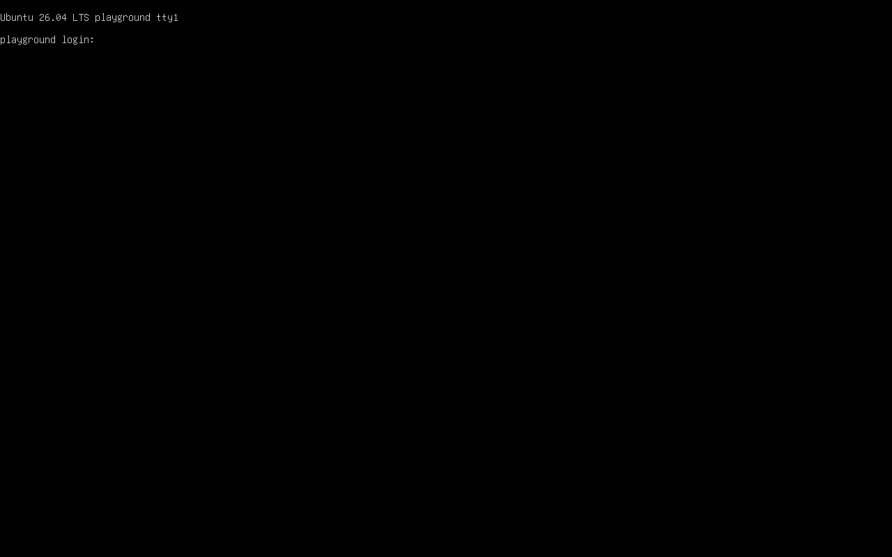

# qemu-playground

A small, observable QEMU/KVM lab with two profiles: **Ubuntu Server 26.04** and
**Windows 11**. A Bash/fzf menu teaches the same CLI you can run yourself.
No libvirt, system services, personal SSH configuration, or root privileges are
needed for normal operation.

**Validation status:** on 2026-09-16 both profiles were installed unattended on a
real KVM host and then reached over SSH — Ubuntu 26.04 on the first attempt in
371 s, Windows 11 on the fourth in 2,021 s, with the three earlier failures kept
and reported. The successful Windows run carries no `intervention` event: it was
not assisted. The automated suite (31 tests) covers configuration, seed rendering,
process ownership, checksum invalidation, cleanup, completion/failure handling,
QMP framing and screenshots. What is still unproven — graceful Windows shutdown
timing, recovery from a genuinely stalled installer, the tmux layout — is listed
attempt by attempt in [validation](docs/VALIDATION.md).

## What a finished run looks like

Both images are `work/PROFILE/screenshots/` frames from the run described in
[validation](docs/VALIDATION.md); nothing is staged.



*Ubuntu 26.04 after the unattended installation: the server console at its login prompt. The lab
does not log in there — it connects over SSH with a dedicated key.*


*Windows 11 during the attempt that passed: OOBE is over and the unattended setup script is still
working in the console behind, installing the OpenSSH capability. Screenshots are taken passively
over QMP, so capturing this costs the guest nothing and sends it no keys.*

## Start here

`./lab config init` prints the console password it generates, something like
`Virtio-6258`: short enough to type at the graphical console, with an upper case
letter, a lower case letter and a digit so Windows accepts it even where the local
complexity policy is on. It is stored in `.env` (0600, gitignored) and neither
guest ever accepts it over SSH, which is key-only.

```bash
./lab doctor                 # read-only checks and suggested apt command
./lab doctor --install       # shows the command and asks before using sudo
./lab config init            # creates a private .env with a random password
./lab config show            # active values and their source; password hidden
./lab                        # interactive menu
```

The menu's first entry is always the prerequisite checker. Missing or inapplicable
actions stay visible, marked `[blocked]`, with the reason spelled out in the
preview pane next to the command. `Ctrl-P` switches profiles; `Ctrl-R` refreshes.
`Ctrl-C` comes back to the menu; `Esc` leaves it, and so does the last entry, so
quitting never depends on knowing a key. After a command runs, any key returns to
the list.
The menu is English by default; `LAB_LANG=it` in `.env` translates its labels,
states and blocker reasons. Nothing else changes: commands, logs, events and the
HTML report stay English, and the report keeps its Italian quick guide. With tmux installed the menu opens a commands pane and a live log pane.
Otherwise fzf's preview displays the command and follows the selected VM's log.
`LAB_NO_TMUX=1 ./lab` selects that fallback explicitly.

Long menu operations detach into the background. `Ctrl-C` leaves a foreground
view and returns to the menu; it does not stop detached installers or VMs.
The CLI `install` and `up` also detach by default. Use `--foreground` in automation
when you need the final exit code. A background command returning zero means its
worker was launched, **not** that the installation succeeded.

## Ubuntu, one step at a time

```bash
./lab iso ubuntu-26.04 download      # curl resume + pinned SHA-256 verification
./lab iso ubuntu-26.04 verify
./lab prepare ubuntu-26.04
./lab install ubuntu-26.04          # background, timeline recorded automatically
./lab status
# Wait for a passed installation and spontaneous QEMU exit, then:
./lab start ubuntu-26.04
./lab ssh ubuntu-26.04 -- 'uname -a'
./lab shot ubuntu-26.04             # capture via QMP, convert to PNG, xdg-open
./lab console ubuntu-26.04          # read-only serial log, bounded follow
./lab report ubuntu-26.04
./lab stop ubuntu-26.04
```

Or run the same steps as one operation:

```bash
./lab up ubuntu-26.04 --dry-run     # no writes, downloads or processes
./lab up ubuntu-26.04 --foreground  # includes boot and key-authenticated SSH check
```

Ubuntu boots the ISO's extracted kernel/initrd directly with `autoinstall` and
NoCloud seed media. No menu keys are injected. Network access is needed for the
SSH package if it is not available on the installation media; the optional QEMU
agent is best effort. The completion marker follows `sync` and a block-device
flush. The host then waits for QEMU to exit on its own. Failure and timeout keep
the VM and disk available, take a final screenshot where possible, and generate
an HTML report.

## Windows is a first-class, gated profile

[Windows setup instructions](docs/WINDOWS.md) explain the pinned Italian x64 ISO,
signed QGA MSI, OVMF Secure Boot firmware and software TPM. There is no automatic
Microsoft download URL: vendor links expire. Import matching media explicitly:

```bash
./lab iso windows-11 import --source /path/to/windows.iso
./lab prepare windows-11
./lab install windows-11
./lab start windows-11              # after installation has powered itself off
./lab ssh windows-11 -- 'ver'
./lab ssh windows-11 -- 'powershell.exe -NoProfile -Command "Get-ComputerInfo"'
./lab agent windows-11 ping
./lab agent windows-11 osinfo
./lab agent windows-11 ip
```

Absent media or agent inputs block preparation with a specific message. The menu
keeps the profile and its commands visible. Windows uses `cmd.exe`, SATA storage,
an emulated network adapter and an independent QGA channel on COM2. It never
receives `sh -lc`. COM1 carries installer diagnostics, not an interactive shell.

## CLI reference

| Command | Purpose |
| --- | --- |
| `doctor [--install]` | Tools, KVM access, RAM, disk and explicit apt proposal |
| `config init\|show` | Private configuration, values and provenance |
| `iso VM download\|verify\|redownload\|delete\|import` | Separate media actions; `import` takes `--source` |
| `prepare VM` | Dedicated key, qcow2 disk, installation seed and boot inputs |
| `install VM [--foreground] [--nudge]` | Bounded installer, passive timeline, retained failures |
| `up VM [--foreground]` | Configuration through installed guest with working SSH |
| `start VM` | Boot the disk with no installation media attached |
| `view VM` | Open the graphical console, when `LAB_VNC_PORT` is set |
| `stop VM [--force]` | ACPI, then QGA fallback; forced signals only when requested |
| `status` | Both profiles, owned PID, ISO verification, ports, usage and last result |
| `ssh VM` | Interactive session on the dedicated key, with a real tty |
| `ssh VM -- COMMAND` | Dedicated key, no password prompts; actual remote exit status |
| `agent VM ping\|info\|osinfo\|ip\|shutdown` | QGA without guest networking |
| `console VM [--timeout 300]` | Read-only Linux serial log |
| `shot VM [--no-open] [--nudge]` | Diagnostic capture; only explicit nudge sends Enter |
| `report VM [--pdf] [--open]` | Self-contained HTML and optional equivalent PDF; `--open` hands it to the desktop viewer |
| `clean VM TARGET... [--dry-run] [--yes]` | Enumerate and remove only selected paths |

Every command accepts `--dry-run`. Place SSH's host options **before** the VM name,
for example `./lab ssh --dry-run ubuntu-26.04 -- 'uname -a'`; everything after
`--` belongs to the guest. `--background` is also available for downloads and
preparation. SSH remains foreground to preserve its exit status.

A graphical console is available: `LAB_VNC_PORT` defaults to 5940 (Windows takes
the next port, and 5940 stays clear of libvirt, which hands out 5900 upwards),
bound to localhost, opened with `lab view VM`. Set it to 0 to switch it off.

Exposing a console and using one are different claims, and the report keeps them
apart. Opening the port is recorded and reported as "a graphical console was
exposed; no client connected to it". During an installation the lab also asks QEMU
whether anyone is actually attached, and only when a client connects does the
verdict say the run is no longer provably unattended. Passive screenshots remain
the default way to watch: they cannot type.

The lab reads `.env` as data; it never executes shell substitutions or sources it.
Environment variables do not silently override configuration. `.env.example`
lists all settings. Ubuntu uses port 2400 and Windows 2401 by default, bound only
to localhost. Adjust `LAB_SSH_PORT` to move both. KVM is the default;
`LAB_ACCEL=tcg` is available for slow emulation and firmware diagnostics.

SSH uses `keys/id_ed25519`, `BatchMode=yes`, `IdentitiesOnly=yes`, no personal
configuration and `keys/known_hosts`. A changed guest host key is deliberately
rejected. After intentionally replacing a guest disk, remove only that guest's
old entry:

```bash
ssh-keygen -R '[127.0.0.1]:2400' -f keys/known_hosts
```

## Evidence and cleanup

Runtime files live under `work/PROFILE/`: `steps.log`, `serial.log`, `qemu.log`,
`qemu-command.txt`, `events.jsonl`, the disk, seed and screenshots. Earlier serial
logs are preserved under `logs/`. QMP operations share a bounded file lock; they
never race the recorder for the single-client socket. Black screenshots become
text frames containing the serial tail. Unchanged frames are deduplicated.

`report` produces `out/PROFILE.html` with embedded images, chronological commands,
durations, previous attempts, latest screen alongside the verdict, and a short
Italian user guide. The same `screenshots/*.png` files can be selected for README
illustrations after a real run; no staged images are presented as installed VMs.
[out/example.html](out/example.html) is a small, explicitly synthetic report example.
PDF dependencies (`markdown`, `weasyprint`, plus WeasyPrint's native libraries) are
loaded only on request. Missing dependencies leave HTML available.

```bash
./lab clean ubuntu-26.04 disk seed --dry-run
./lab clean ubuntu-26.04 disk seed       # lists paths, asks once, keeps logs/screens
./lab clean ubuntu-26.04 screenshots logs
./lab clean ubuntu-26.04 all             # excludes ISO AND shared SSH keys
./lab clean ubuntu-26.04 iso             # separate, explicit expensive-media choice
./lab clean ubuntu-26.04 keys            # shared by both guests; use deliberately
```

An attempted installation disk is never reused automatically. Stop the VM and
review its evidence before selecting `clean disk seed` to retry. `--keep-failed`
is always active; there is no unattended destructive retry. Cleanup is per path,
rejects managed symlinks and blocks while the VM or its lifecycle worker is active.
Cleanup itself leaves an audit event. Reports can contain output of commands you
ran inside a guest; review them before sharing.

## Development

Python 3.10+ and the standard library suffice for the core. Scripts explicitly
use Bash even when the user's shell is zsh. To add the command to your shell, add
this directory to `PATH` in `~/.zshrc`.

```bash
python3 -m unittest discover -s tests -v
bash -n lab scripts/menu.sh
shellcheck lab scripts/menu.sh
# Optional real QEMU firmware-only checks, no ISO or KVM:
python3 -m unittest discover -s tests -p smoke_qemu.py -v
```

Normal tests use temporary fixtures and do not read your `.env`, keys, media or VM
disks. CI runs those tests, shell checks and dry runs, without QEMU or ISO images.
See [decisions](docs/DECISIONS.md), [checksum provenance](docs/CHECKSUMS.md) and
[validation](docs/VALIDATION.md). The original local specification remains in `PROMPT.md`, excluded from Git because it contains machine-specific paths.

## License

MIT — see [LICENSE](LICENSE). Vendor media downloaded or imported at run time keeps
its own license; see [checksum provenance](docs/CHECKSUMS.md).

## Related

Two siblings live next to this one and share the same habit — a run has to leave evidence:

- **[qlab](https://github.com/manzolo/qlab)** — ready-made QEMU teaching labs as plugins: DNS,
  firewall, RAID, LDAP, mail, cyber-lab, systems-lab, container-lab. Where this repo watches two
  machines closely, qlab builds many small ones to learn on.
- **[qemu-iso-lab](https://github.com/manzolo/qemu-iso-lab)** — unattended recipes that install a
  real desktop from an ISO and can then be copied onto bare metal.

This is the smallest of the three: two profiles, installed unattended and watched while they do it.
